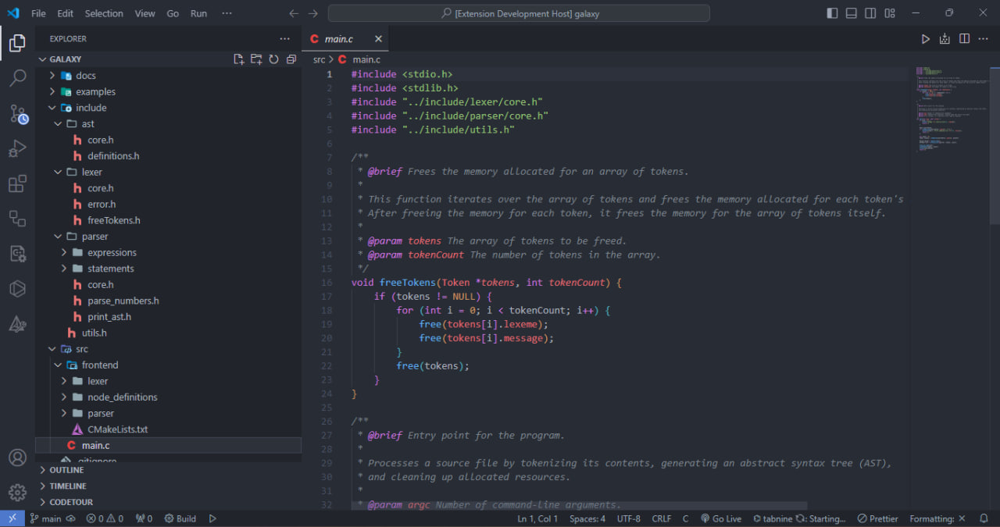
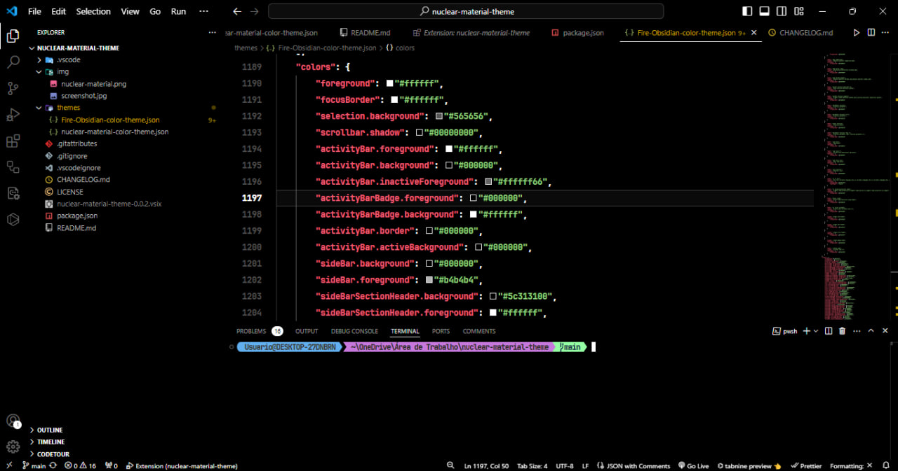

# nuclear-material-theme 

☢️ A fresh atomic theme just came out of the oven. ☢️


✨ Nuclear-Material offers a Hand-selected colors, so as not to tire your eyes and boost your creativity ✨

> [!NOTE]
> This theme pack contains a theme that is a fork of the onedark-pro theme..

### See aslo

[OneDark-Pro](https://github.com/Binaryify/OneDark-Pro)

### Screenshot
- nuclear-material


- Fire Obsidian


> [!NOTE]
> We recommend this configuration to boost your workflow.

```json
 "editor.fontSize": 15,
 "editor.lineHeight": 30,
 "editor.fontFamily": "JetBrains Mono",
```

### Contribute

That said, there's a bunch of ways you can contribute to this project, like by:

* ⭐ Giving a star on this repository (this is very important and costs nothing)
* 🪲 Reporting a bug
* 📄 Improving this documentation
* 🚨 Sharing this project and recommending it to your friends
* 💻 Submitting a pull request to the official repository

## Contributors

This project exists thanks to all the people who contribute. 

<a href="https://github.com/BrunoCiccarino/nuclear-material.vscode/graphs/nuclear-material.vscode">
  
</a>

**Enjoy!**
